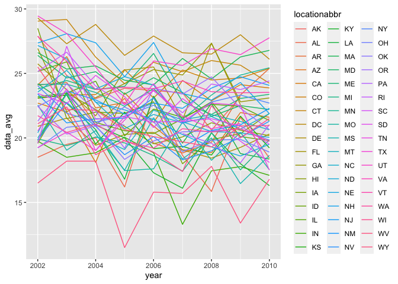
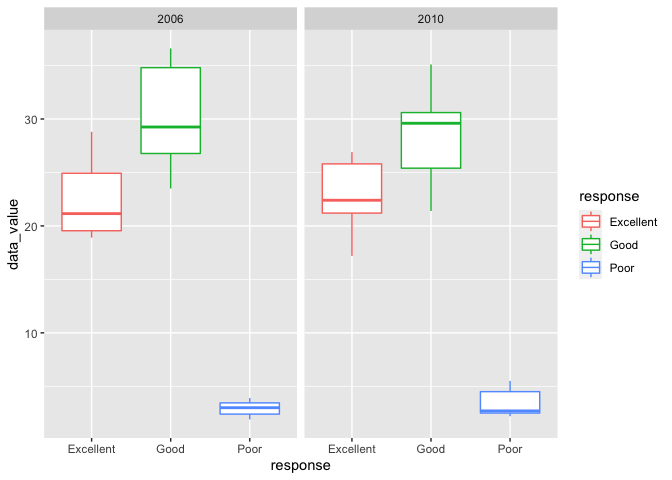
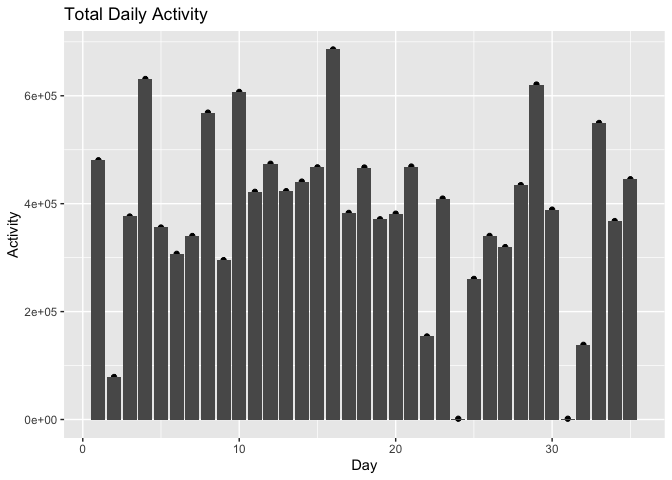
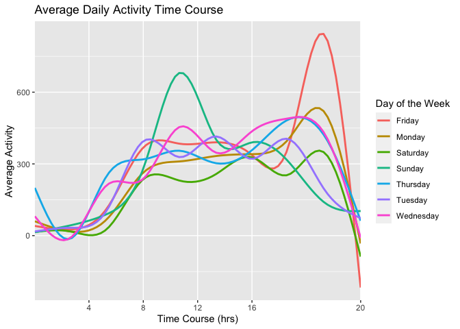

P8105 Homework 3
================
Tara Ahi
10/19/2021

``` r
library(tidyverse)
library(p8105.datasets)
library(httr)
library(jsonlite)
```

# Problem 1

## Instacart

Most popular aisles and number of items ordered:

``` r
data("instacart")
n_aisle = 
  instacart %>% 
  count(aisle) %>% 
  arrange(desc(n))

head(n_aisle, 5)
```

    ## # A tibble: 5 × 2
    ##   aisle                           n
    ##   <chr>                       <int>
    ## 1 fresh vegetables           150609
    ## 2 fresh fruits               150473
    ## 3 packaged vegetables fruits  78493
    ## 4 yogurt                      55240
    ## 5 packaged cheese             41699

This tells us that what the most popular aisles are and how many items
are ordered from each:

-   fresh vegetables with 150,609
-   fresh fruits with 150,473
-   packaged vegetables and fruits with 78,493
-   yogurt with 55,240
-   packaged cheese with 41,699

### Describing the data

The **instacart** data set has 1384617 observatoins and 15 variables.
There are 134 aisles.

### Plot for aisles with more than 10,000 items ordered

<!-- -->

This plot displays the aisles with over 10,000 items ordered along with
the number of items ordered from each. The graph is ordered from least
to greatest moving left to right.

### Most popular items from Baking Ingredients, Dog Food Care and Packaged Vegetables and Fruits

| aisle              | product\_name                                   | frequency | product\_rank |
|:-------------------|:------------------------------------------------|----------:|--------------:|
| baking ingredients | light brown sugar                               |       157 |             1 |
| baking ingredients | pure baking soda                                |       140 |             2 |
| baking ingredients | organic vanilla extract                         |       122 |             3 |
| dog food care      | organix grain free chicken & vegetable dog food |        14 |             1 |
| dog food care      | organix chicken & brown rice recipe             |        13 |             2 |
| dog food care      | original dry dog                                |         9 |             3 |

Three most popular items from aisles Baking Ingredients, Dog Food Care,
and Packaged Vegetables and Fruits

As we can see from the table, there is no information on items from the
**packaged fruits vegetables** aisle. The three most popular items from
**baking ingredients** are *light brown sugar*, *pure baking soda* and
*organic vanilla extract*. The three most popular items from **dog food
care** are *organix grain free chicken & vegetable dog food*, *organix
chicken & brown rice recipe* and *original dry dog*.

### Information on Pink Lady Apples and Coffee Ice Cream

The below table shows the mean hour of day when Pink Lady apples and
coffee ice cream are ordered each day of the week.

| product\_name    | Friday | Monday | Saturday | Sunday | Thursday | Tuesday | Wednesday |
|:-----------------|-------:|-------:|---------:|-------:|---------:|--------:|----------:|
| coffee ice cream |     15 |     14 |       12 |     14 |       15 |      14 |        15 |
| pink lady apple  |     11 |     14 |       16 |     13 |        8 |      14 |        13 |

Average hour of day when Pink Lady apples and coffee ice cream are
ordered each day of the week

# Problem 2

## BRFSS Data

\[ENTER DESCRIPTION\]

``` r
data("brfss_smart2010")

cleaned_brfss = 
  brfss_smart2010 %>% 
  janitor::clean_names() %>% 
  filter(topic == "Overall Health", response %in% c("Excellent", "Very Good", "Good", "Poor")) %>% 
  mutate(response = factor(response, levels = c("Excellent", "Very Good", "Good", "Poor"))) %>% 
  separate(locationdesc, c("state", "location", "rest")) %>% 
  unite(location, c("location", "rest")) %>% 
  arrange(response)

cleaned_brfss
```

    ## # A tibble: 6,375 × 24
    ##     year locationabbr state location  class  topic question response sample_size
    ##    <int> <chr>        <chr> <chr>     <chr>  <chr> <chr>    <fct>          <int>
    ##  1  2010 AL           AL    Jefferso… Healt… Over… How is … Excelle…          94
    ##  2  2010 AL           AL    Mobile_C… Healt… Over… How is … Excelle…          91
    ##  3  2010 AL           AL    Tuscaloo… Healt… Over… How is … Excelle…          58
    ##  4  2010 AZ           AZ    Maricopa… Healt… Over… How is … Excelle…         269
    ##  5  2010 AZ           AZ    Pinal_Co… Healt… Over… How is … Excelle…          68
    ##  6  2010 AZ           AZ    Pima_Cou… Healt… Over… How is … Excelle…         133
    ##  7  2010 AR           AR    Benton_C… Healt… Over… How is … Excelle…          67
    ##  8  2010 AR           AR    Pulaski_… Healt… Over… How is … Excelle…         100
    ##  9  2010 AR           AR    Washingt… Healt… Over… How is … Excelle…          47
    ## 10  2010 CA           CA    Alameda_… Healt… Over… How is … Excelle…         167
    ## # … with 6,365 more rows, and 15 more variables: data_value <dbl>,
    ## #   confidence_limit_low <dbl>, confidence_limit_high <dbl>,
    ## #   display_order <int>, data_value_unit <chr>, data_value_type <chr>,
    ## #   data_value_footnote_symbol <chr>, data_value_footnote <chr>,
    ## #   data_source <chr>, class_id <chr>, topic_id <chr>, location_id <chr>,
    ## #   question_id <chr>, respid <chr>, geo_location <chr>

### States with seven or more locations in 2002 and 2010

``` r
brfss_2002 =
  cleaned_brfss %>% 
  filter(year == "2002") %>% 
  group_by(state) %>% 
  distinct(location) %>% 
  count(state) %>% 
  filter(n > 6)
```

\[ADD DESCRIPTION FOR 2002\]

``` r
brfss_2010 =
  cleaned_brfss %>% 
  filter(year == "2010") %>% 
  group_by(state) %>% 
  distinct(location) %>% 
  count(state) %>% 
  filter(n > 6)
```

\[ADD DESCRIPTION FOR 2010\]

Spaghetti plot:

``` r
cleaned_brfss %>% 
  select(year, locationabbr, response, data_value, geo_location) %>% 
  filter(response == "Excellent") %>% 
  group_by(locationabbr, year) %>% 
  mutate(data_avg = mean(data_value)) %>% 
  select(year, locationabbr, data_avg) %>% 
  
  ggplot(aes(x = year, y = data_avg, group = locationabbr, color = locationabbr)) +
  geom_line() +
  theme(legend.position = "right")
```

<!-- -->

Two panel plot:

``` r
cleaned_brfss %>% 
  filter(locationabbr == "NY", year %in% c("2006", "2010")) %>% 
  ggplot(aes(x = response, y = data_value, color = response)) +
  geom_boxplot() +
  facet_grid(. ~ year)
```

<!-- -->

# Problem 3

## Importing and Cleaning Accelerometer Data

``` r
accelerometer_df = read_csv("./data/accel_data.csv")

cleaned_accel_df = 
  accelerometer_df %>% 
  pivot_longer(
    cols = activity.1:activity.1440,
    names_to = "activity_number",
    values_to = "activity_counts",
    names_prefix = "activity.") %>% 
  mutate(weekend_day = (day == "Saturday" | day == "Sunday"))
```

\[DESCRIPTION\]

``` r
total_activity = 
  cleaned_accel_df %>% 
  group_by(day_id) %>% 
  summarize(total_activity_counts = sum(activity_counts))

knitr::kable(total_activity)
```

| day\_id | total\_activity\_counts |
|--------:|------------------------:|
|       1 |               480542.62 |
|       2 |                78828.07 |
|       3 |               376254.00 |
|       4 |               631105.00 |
|       5 |               355923.64 |
|       6 |               307094.24 |
|       7 |               340115.01 |
|       8 |               568839.00 |
|       9 |               295431.00 |
|      10 |               607175.00 |
|      11 |               422018.00 |
|      12 |               474048.00 |
|      13 |               423245.00 |
|      14 |               440962.00 |
|      15 |               467420.00 |
|      16 |               685910.00 |
|      17 |               382928.00 |
|      18 |               467052.00 |
|      19 |               371230.00 |
|      20 |               381507.00 |
|      21 |               468869.00 |
|      22 |               154049.00 |
|      23 |               409450.00 |
|      24 |                 1440.00 |
|      25 |               260617.00 |
|      26 |               340291.00 |
|      27 |               319568.00 |
|      28 |               434460.00 |
|      29 |               620860.00 |
|      30 |               389080.00 |
|      31 |                 1440.00 |
|      32 |               138421.00 |
|      33 |               549658.00 |
|      34 |               367824.00 |
|      35 |               445366.00 |

``` r
ggplot(total_activity, aes(x = day_id, y = total_activity_counts)) +
  geom_point() +
  geom_col(position = "dodge") +
  labs(title = "Total Daily Activity", x = "Day", y = "Activity")
```

<!-- -->

\[ADD DESCRIPTIONS\]

``` r
cleaned_accel_df %>% 
  mutate(activity_number = as.numeric(activity_number)) %>% 
  group_by(day, activity_number) %>% 
  summarize(avg_value = mean(activity_counts)) %>% 
  ggplot(aes(x = activity_number, y = avg_value, color = day)) +
  geom_smooth(se = FALSE) +
  scale_x_discrete(limit = c(240,480,720,960,1440), labels = c("4","8","12","16","20","24")) +
  labs(title = "Average Daily Activity Time Course", x = "Time Course (hrs)", y = "Average Activity", color = "Day of the Week")
```

<!-- -->

\[DESCRIPTION\]
